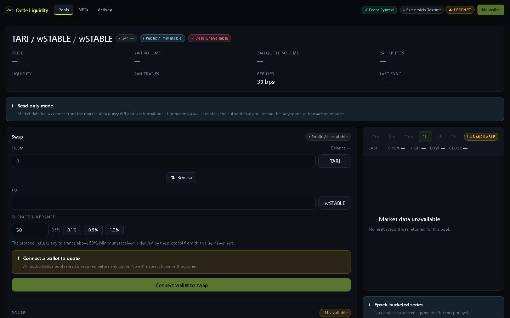
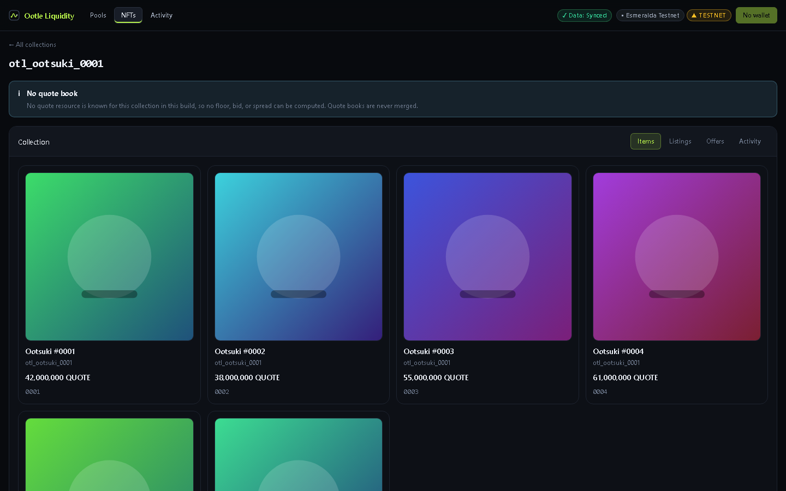
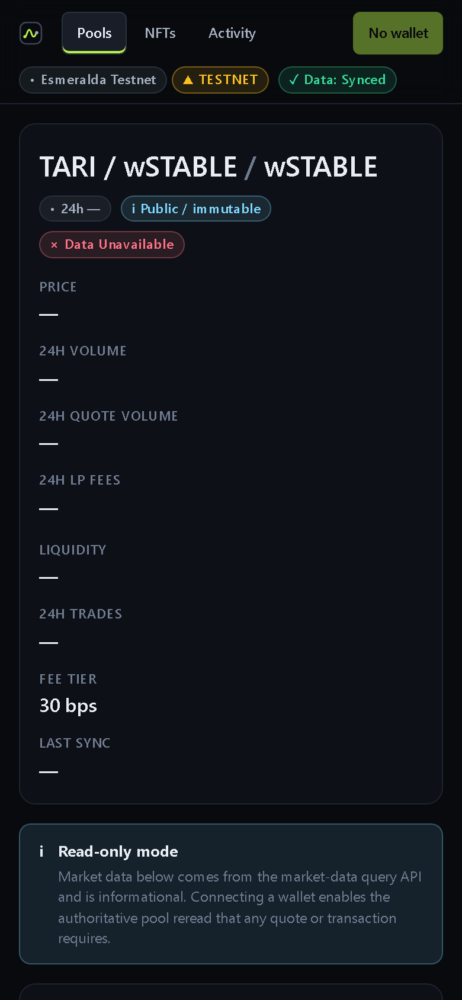
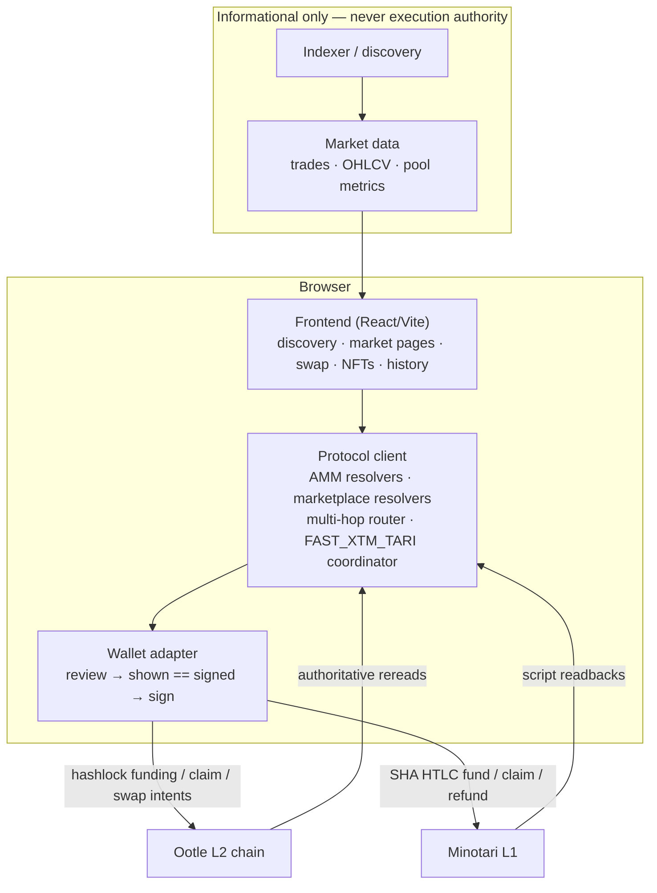

<div align="center">

# Tari/Ootle Liquidity Protocol

**A noncustodial liquidity and market protocol for Tari Ootle — AMM pools, LP markets, NFT trading, market data, browser-based trading, and composable multi-asset routing.**

[](https://github.com/GSXRspartan/tari-ootle-liquidity-protocol/actions/workflows/node-tests.yml)
[](https://github.com/GSXRspartan/tari-ootle-liquidity-protocol/actions/workflows/security-engine-tests.yml)
[](#licensing)

`Swift` `TypeScript` `Rust` · **Esmeralda testnet** · **mainnet disabled**

</div>

> [!WARNING]
> **TESTNET / EXPERIMENTAL.** Mainnet is intentionally disabled in every layer of this build.
> Do not use funds you cannot afford to lose. Nothing in this repository is an audit, a
> guarantee, or a claim of production readiness — see
> [Current status](#current-status) and [Security](#security) for exactly what has and has
> not been verified.

---

**Jump to** — [Status](#current-status) · [Screenshots](#screenshots) · [Capabilities](#capabilities) ·
[Architecture](#architecture) · [Trust model](#trust-model) · [The AMM](#the-amm) ·
[NFT marketplace](#nft-marketplace) · [Cross-layer routing](#experimental-cross-layer-routing) ·
[Market data](#market-data) · [Frontend](#frontend) · [Wallet](#wallet-architecture) ·
[Security](#security) · [Development](#development) · [Testnet status](#testnet-status) ·
[Roadmap](#roadmap)

<div align="center">

### Pool market · desktop



<table>
  <tr>
    <td align="center"><em>NFT collection · desktop</em><br></td>
    <td align="center"><em>Pool market · mobile</em><br></td>
  </tr>
</table>

</div>

*Sampled from the shipped production bundle driven against the same deterministic indexer
fixtures the browser security suite uses. These show the **interface, not live market state** —
the disconnected state is exactly what renders (no wallet, no synthetic balances). They are not
evidence of live-chain activity. Reproduce with `pnpm --filter @tari-ootle/web run screenshots`.*

---

## Current status

Status vocabulary:

| Marker | Meaning |
| --- | --- |
| ✅ `IMPLEMENTED` | The code path exists, is exercised by this repository's own suites, and has no known fund-loss path under the tested model. **Not** a claim of live-chain exercise. |
| 🧪 `EXPERIMENTAL` | Built and unit-tested, but gated off by default or not yet exercised end to end against a live chain. |
| 🚧 `BLOCKED_EXTERNAL` | Depends on a capability that does not exist upstream today. Not fixable in this repository. |
| ⚙️ `CONFIGURED_NOT_LIVE` | The configuration exists and is tested; no live deployment has been observed serving it. |
| 🔒 `DISABLED` | Refused unconditionally, by design, in every layer. |

### Core protocol

| Capability | Status |
| --- | --- |
| Public fungible AMM (constant product) | ✅ `IMPLEMENTED` |
| Add / remove liquidity with LP accounting | ✅ `IMPLEMENTED` |
| LP trading fees (30 bps default, 100% to LPs) | ✅ `IMPLEMENTED` |
| TARI markets | ✅ `IMPLEMENTED` |
| Public fungible markets | ✅ `IMPLEMENTED` |
| wSTABLE (issuer-controlled quote asset) markets | ✅ `IMPLEMENTED`, with explicit issuer-risk disclosure |
| Routing / multi-hop composition | ✅ `IMPLEMENTED` |
| First-depositor and permanent LP-lock protections | ✅ `IMPLEMENTED` |
| On-chain `min_output` slippage enforcement | ✅ `IMPLEMENTED` |

### Marketplace and data

| Capability | Status |
| --- | --- |
| NFT fixed-price listings | ✅ `IMPLEMENTED` |
| NFT Buy Now | ✅ `IMPLEMENTED` |
| NFT item offers | ✅ `IMPLEMENTED` |
| NFT collection bids (partial fills) | ✅ `IMPLEMENTED` |
| Sell Now (fill a collection bid) | ✅ `IMPLEMENTED` |
| Durable operation history | ✅ `IMPLEMENTED` |
| `UNKNOWN` reconciliation (no blind resubmit) | ✅ `IMPLEMENTED` |
| Market data (trades, OHLCV, pool metrics) | ✅ `IMPLEMENTED` — informational only, never execution authority |

### Frontend and hosting

| Capability | Status |
| --- | --- |
| Browser trading frontend (React 19 + Vite 6) | ✅ `IMPLEMENTED` |
| Browser wallet abstraction + `shown == signed` gate | ✅ `IMPLEMENTED` |
| Live Esmeralda endpoint discovery + identity gate | ✅ `IMPLEMENTED` |
| Cloudflare Pages deployment (security headers) | ⚙️ `CONFIGURED_NOT_LIVE` — R-1 open, no credentials available |
| GitHub Pages deployment | 🔒 `DISABLED` as an interactive target — cannot serve the security policy |

### Cross-layer liquidity routing (experimental)

| Capability | Status |
| --- | --- |
| `FAST_XTM_TARI` coordinator | 🧪 `EXPERIMENTAL` — protocol complete, real submit gated OFF by default |
| `XTM → TARI → AMM` route composition | ✅ `IMPLEMENTED`, 🚧 externally gated behind the hop-1 settlement proof |
| Browser L1 SHA atomic-swap primitives | 🚧 `BLOCKED_EXTERNAL` — no upstream browser wallet capability |
| Real cross-layer submission | 🔒 `DISABLED` by default (`TARI_LIQUIDITY_ENABLE_REAL_CROSSCHAIN_SUBMIT`) |
| Reverse route (`TARI → XTM`) | 🚧 `BLOCKED_EXTERNAL` — no L1 amount-authority API |
| Mainnet | 🔒 `DISABLED` at every layer |

## Capabilities

- **Public fungible AMM** on Ootle — constant-product pools with LP shares, LP trading fees, and
  strict on-chain access rules (no admin withdrawal, no upgrade keys, no owner).
- **NFT marketplace** — fixed-price listings, item-specific offers, collection-wide bids, and
  Buy Now / Sell Now, all settled against an exact `(ResourceAddress, NonFungibleId)` identity
  with an authoritative reread before anything is signed.
- **Market data** — canonical trade/activity records, exact rational prices, OHLCV candles, pool
  metrics, and an honest outage/degraded model. Strictly informational.
- **Browser trading frontend** — pool discovery, market pages with candlestick/volume charts,
  swap, add/remove liquidity, NFT marketplace, activity history with reconciliation, wallet
  state, and mobile-responsive layout down to 360 px.
- **Provider-backed liquidity infrastructure** — a single `window.tari` integration boundary,
  a wallet adapter that reviews every request before signing, and a browser-first path that does
  not require `walletd`, a console wallet, or a local clone.
- **Experimental cross-layer liquidity routing** using noncustodial atomic settlement primitives —
  `XTM → TARI → AMM` composed through the `FAST_XTM_TARI` coordinator: a Minotari L1 SHA-256 HTLC
  leg, an Ootle L2 hashlock leg, a terminal settlement proof, and a state machine that fails
  closed at every irreversible step. This is an underlying routing primitive, not the product's
  identity; see [Cross-layer routing](#experimental-cross-layer-routing).

### What this is not

- Not a custody service, an exchange, or a yield product. Keys stay with the user.
- Not a browser atomic-swap frontend and not a replacement for a dedicated peer-to-peer atomic
  swap application. The cross-layer path here is one routing primitive among several, and it is
  the least proven of them.
- Not a private or confidential AMM. Pool reserves and trade amounts are public by design;
  stealth/confidential assets are out of scope for the public pools (see
  [docs/ROUTE_MATRIX.md](docs/ROUTE_MATRIX.md)).
- Not audited, not production ready, not mainnet ready, and not a guaranteed legal safe harbour.
- Not a repository that will ever claim those things without evidence.

## Architecture



## Trust model

**Market data is not execution authority.** Discovery responses may be hostile or stale; every
swap, liquidity, marketplace, and cross-layer action re-reads the authoritative component state
from the wallet/chain before anything is constructed, and a requote or refusal is the correct
outcome of a stale read. A poisoned indexer can degrade what you *see*, never what you *sign*.

Trust boundaries in one line each:

| Layer | Authority it holds |
| --- | --- |
| Discovery / indexer | Informational only; bounded transport; failures are states, never empty results |
| Chain / wallet reread | The only settlement authority; resolvers fail closed on unvouchable state |
| Frontend | Presentation and user intent; display values are type-branded away from execution inputs |
| Wallet | Signing authority; the reviewed request is forwarded verbatim (`shown == signed`) |
| Cross-layer coordinator | State, deadlines, UNKNOWN reconciliation, restart recovery; never trusts durable state alone |

## The AMM

- **Exact integer math everywhere.** Amounts are BigInt decimal strings on the client and
  checked `u128`/192-bit intermediates on-chain. No floats, no rounding in the user's favour.
- **Constant product with fees.** Output is `floor(rOut · e / (rIn + e))` where
  `e = floor(in · (10000 − feeBps) / 10000)`; the full input is deposited, so the fee stays in
  the pool and the constant product never decreases.
- **First-deposit protection.** Initial shares are `floor(sqrt(a·b))` with a permanently locked
  minimum; subsequent mints take the weaker proportional side against pre-deposit reserves.
- **`min_output` is on-chain.** Slippage protection is enforced by the pool template; the
  frontend derives it from a fresh quote and refuses to floor it to zero without an explicit,
  auditable choice.
- **Resource safety.** Assets are classified — `CANONICAL_TARI`, `PUBLIC_IMMUTABLE_OR_VETTED`,
  `ISSUER_CONTROLLED`, `UNKNOWN`, `UNSUPPORTED` — by exact `ResourceAddress` (never by symbol or
  metadata), and issuer-controlled assets require explicit acknowledgement before routing.
- **Client/chain parity.** An independent reference model (Rust) and an independent BigInt model
  (TypeScript) both re-derive the template's semantics; swap/LP sequence conservation is asserted
  by property tests rather than by trusting the implementation as its own oracle.

Deeper material: [docs/FIRST_DEPOSIT_AUDIT.md](docs/FIRST_DEPOSIT_AUDIT.md),
[docs/LP_AUTHORITY_MODEL.md](docs/LP_AUTHORITY_MODEL.md),
[security/LP_INVARIANTS.md](security/LP_INVARIANTS.md).

## NFT marketplace

- **Fixed-price listings** — one escrowed NFT per component, exact-price buy, seller-only
  cancel, expiry that blocks buys.
- **Item offers** — a buyer-funded escrow for one exact `(collection, nftId)`, buyer-only cancel,
  one-time refund at expiry.
- **Collection bids** — a standing limit order for up to N items from one collection with
  per-item partial fills; `remaining_escrow == price_per_nft × remaining_quantity` is maintained
  through fill/cancel/expiry, and terminal states refuse further fills.
- **Sell Now** — ranks discovered bids but settles only against an authoritative readback of the
  selected bid component.
- Identity is the exact `ResourceAddress + NonFungibleId`; collection names and metadata never
  influence settlement. Discovered marketplace state is a candidate, never a authority: every
  route rereads the listing/offer/bid component before constructing a transaction.

Deeper material: [docs/NFT_DESIGN.md](docs/NFT_DESIGN.md).

## Experimental cross-layer routing

> **Framing.** This is **experimental cross-layer liquidity routing using noncustodial atomic
> settlement primitives**. It is an underlying routing capability of the protocol, not the
> product's headline, and not a replacement for a dedicated peer-to-peer atomic swap
> application. It is also the least proven part of this repository: the two load-bearing
> upstream gaps below are real and unchanged. Read the limitations before reading the design.

Conceptually:

```text
XTM on Minotari L1
        ↓  SHA-256 hashlock (H = SHA256(S), S generated inside the L1 wallet)
TARI on Ootle L2
        ↓  terminal settlement proof
AMM → destination asset
```

The coordinator (`packages/protocol-client/src/crosschain`) runs an explicit state machine —
`QUOTED → RESERVED → L1_FUNDING → L1_FUNDED → L2_FUNDING → BOTH_FUNDED → CLAIM_ARMED → …` — with
these load-bearing properties:

- **Quotes are validated entirely before inventory is reserved**, and a quote can back at most
  one reservation (replay refused).
- **Second-leg funding requires an authoritative first-leg verification stamp**; the state
  machine itself refuses to record unproven evidence, and `amountAuthoritative: false` fails
  closed.
- **`CLAIM_ARMED` re-observes both chains fresh** at arm time — a reorg, a spend, a capability
  loss, or a deadline drift between funding and arming moves the session to recovery *before*
  the preimage can be disclosed.
- **UNKNOWN is never failure.** A lost submission response forces reconciliation; terminal
  states stay terminal; recovery is absorbing and never auto-resumes execution.
- **Deadlines live in separate domains** (L1 heights vs L2 epochs), are derived from
  authoritative reads, and are re-checked immediately before every irreversible phase.

### Current cross-layer limitations

1. **Browser L1 atomic primitives are upstream-blocked.** The normal browser wallet/provider
   path does not yet expose the Minotari SHA atomic-swap operations
   (`tari_l1_wasm` has no SHA swap surface). Ordinary browser XTM atomic swaps are therefore
   **not functional today**; the UI shows an explicit blocker rather than a button.
   [docs/TARI_BROWSER_SHA_SWAP_UPSTREAM_PLAN.md](docs/TARI_BROWSER_SHA_SWAP_UPSTREAM_PLAN.md)
   tracks the upstream plan.
2. **L1 amount authority fails closed.** Minotari output amounts live in blinded commitments; a
   base-node readback alone cannot prove the plaintext amount. When no authoritative amount
   evidence exists, the protocol refuses to treat the amount as proven — an intentional safety
   boundary, not a bug. [security/MINOTARI_AUTHORITY_MODEL.md](security/MINOTARI_AUTHORITY_MODEL.md).
3. **Real submission is gated OFF.** Testnet real submission requires the explicit environment
   gate described below; mainnet never passes.

**These three limitations are unchanged by any of the work in this repository**, and no attempt
was made to force browser XTM execution. `CLAIM_ARMED`, amount authority, settlement-proof
revalidation, terminal proof requirements, restart recovery, `UNKNOWN` handling, and preimage
custody are all still enforced and still independently tested.

Deeper material: [docs/FAST_XTM_TARI_ARCHITECTURE.md](docs/FAST_XTM_TARI_ARCHITECTURE.md),
[docs/MINOTARI_ATOMIC_SWAP_API.md](docs/MINOTARI_ATOMIC_SWAP_API.md),
[security/MINOTARI_AUTHORITY_MODEL.md](security/MINOTARI_AUTHORITY_MODEL.md).

## Multi-hop: XTM → TARI → AMM

```text
XTM
 ↓  FAST_XTM_TARI (hop 1, experimental)
TARI on Ootle L2
 ↓  AMM swap (hop 2)
wSTABLE / public token
```

- Hop 2 is constructible **only** from a minted, chain-proven terminal settlement proof; the
  proof is revalidated against authoritative chain state before every hop-2 construction, and
  its age window is a liveness bound, never a substitute for a chain read.
- Hop 2's input is the **actual settled TARI amount** from the proof — never the quote.
- The AMM requotes after hop 1; if the refreshed quote cannot still deliver the user's accepted
  final minimum, the route pauses for a user decision rather than lowering `min_output`.
- **Partial completion is a first-class outcome.** If hop 1 settles and hop 2 fails, the user
  keeps their TARI and the route pauses — it is not reported as a total loss.
- A failed/unknown hop-2 submission is reconciled by durable id; only an authoritative
  `REJECTED`/`NOT_FOUND` lookup ever permits resubmission.

Deeper material: [security/MULTIHOP_INVARIANTS.md](security/MULTIHOP_INVARIANTS.md),
[security/MULTIHOP_ATTACK_MATRIX.md](security/MULTIHOP_ATTACK_MATRIX.md).

## Market data

- Canonical, idempotently-identified trade/activity records (trade / add / remove), derived
  OHLCV candles, recent trades, 24h volume, LP fees, and liquidity metrics.
- Prices are **exact rationals** internally; a single, documented display boundary converts to
  `Number` for the chart.
- Hostile observations are rejected: a trade that would reduce a pool's constant product is
  refused before it can become a candle or a volume ranking.
- The source model is traced from upstream — historical trades via paginated events, live via
  SSE, **no consensus timestamps** (sub-epoch candles are marked unsupported rather than
  fabricated), and **no automatic reorg detection** (`BLOCKED_EXTERNAL`).
- Health is explicit: `SYNCED / SYNCING / STALE / DEGRADED / UNAVAILABLE`, with a global outage
  banner that says what could not be read instead of rendering tables that look empty.

Deeper material: [docs/MARKET_DATA_SOURCE_MODEL.md](docs/MARKET_DATA_SOURCE_MODEL.md),
[security/MARKET_DATA_RESIDUAL_RISKS.md](security/MARKET_DATA_RESIDUAL_RISKS.md).

## Frontend

React 19 · Vite 6 · TypeScript 5.9 · React Router 7 · Lightweight Charts 5.2.1.

- **Pools** — discovery with safety classification, market metrics, search and sorting.
- **Pool market page** — market header, candlestick/volume chart with honest interval support,
  swap card, liquidity panel, route panel, pool activity.
- **NFTs** — collections, item grid with validated off-chain metadata (https-only, size-capped,
  sanitised), listings/offers/bids/quote-book tabs, item detail.
- **Activity** — durable operation history with explicit `UNKNOWN` reconciliation and a clear
  "persisted claim ≠ chain-verified settlement" distinction.
- **Wallet dialog** — status, network, gate state, per-leg capability advertisement.
- **Honest degradation** — global outage notice, per-page unavailable states, no fabricated
  zero-state data, mobile-responsive down to 360px.

The frontend never references `window.tari` outside the single integration boundary
(`services/tariWindow.ts`), which allow-lists methods, bounds non-interactive reads, and never
gives a signing request a deadline.

## Wallet architecture

The production direction is browser-first:

```text
Web app → wallet adapter → browser Tari provider → self-custodial wallet
```

- Normal users are **not** expected to need a console wallet, `walletd`, a shell, a cloned
  backend, or a localhost service — those exist as development/reference paths only
  (`VITE_ENABLE_DEV_PROVIDERS` requires a development build).
- The frontend references `window.tari` in exactly one place
  (`apps/web/src/services/tariWindow.ts`), which allow-lists every method it will call and codes
  every request and reply against the **published contract**
  ([`tari-dapp.d.ts`](https://universe.tari.mw/integration/tari-dapp.d.ts)), not against a
  reverse-engineered copy of one wallet's bridge. The connector's confidential/shielded methods
  are deliberately *not* called: this is a public AMM, and asking a wallet for more than the app
  needs is a cost, not a feature.
- **`window.tari` is one interface implemented by both Tari wallets** — the Sapient browser
  extension and the Tari Universe web wallet — and the app **never detects which one it has**.
  Feature decisions come from `tari_getCapabilities` and from nothing else. A provider is never
  refused for not running in an iframe; the connector is included unconditionally, exactly as the
  official model requires, and it stands aside when an extension already owns `window.tari`.
- **Provider presence is not wallet availability.** A truthy `window.tari` is neither: the
  connector still publishes a provider object on a page it cannot serve. Availability is
  established by a real, connection-independent call (`tari_getNetwork`), and "no wallet", "a
  wallet is present but cannot answer here" and "connected" are three distinct states with three
  different remedies.
- Provider detection is by **object identity** at authorization time. `tari#initialized` and
  `tari:announceProvider` are treated as hints to re-read, never as authority, because an event is
  another thing a hostile page can emit. A provider appearing *after* the app starts is normal
  initialisation and is accepted; a provider *replaced mid-session* invalidates the session and
  every review bound to it.
- Every financial operation goes through the review gate: a differential diff between the
  reviewed transaction and the built intent, identity re-verification at authorization time
  (provider object identity, network, account, capabilities), and the reviewed, deep-frozen
  instructions forwarded verbatim to the signer. Where the account supports
  `capabilities.transactionRequests`, submission goes through the create → approve → submit trio,
  which takes **only a `requestId`** — so no payload can be re-derived between approval and
  broadcast.
- **Honest capability states.** A capability the connected account does not advertise is reported
  as unavailable, and an account that advertises nothing is treated as advertising nothing. There
  is deliberately no silent `walletd` fallback and no placeholder provider, so "the browser cannot
  do this" is visible rather than papered over.

Deeper material: [docs/TARI_WALLET_INTEGRATION_CONFORMANCE.md](docs/TARI_WALLET_INTEGRATION_CONFORMANCE.md),
[docs/FRONTEND_TRUST_BOUNDARIES.md](docs/FRONTEND_TRUST_BOUNDARIES.md),
[docs/FRONTEND_SECURITY_MODEL.md](docs/FRONTEND_SECURITY_MODEL.md),
[docs/TARI_BROWSER_ATOMIC_SWAP_PROVIDER_GAP.md](docs/TARI_BROWSER_ATOMIC_SWAP_PROVIDER_GAP.md).

## Operations and recovery

Operation states are `PENDING → SUBMITTED → CONFIRMED | FAILED | UNKNOWN`:

- **`UNKNOWN ≠ FAILED`.** A lost response is displayed as *unknown* and requires reconciliation
  by durable id; the UI offers no blind retry.
- Only an authoritative lookup that proves rejection or non-existence permits resubmission.
- Restart recovery re-derives real state from both chains rather than trusting the stored
  pre-crash state, and terminal sessions are never re-driven.
- Persisted history is a display cache under tamper resistance: allow-listed fields, forbidden
  fields (including any secret-shaped key) rejected on sight, and a persisted `CONFIRMED` badge
  is always presented as an *unverified claim* until an authoritative reread proves it.

## Security

Security testing has repeatedly found and fixed defects here — including critical- and
high-severity issues — and the repository retains the regressions and attack matrices for every
finding. That is evidence of effort, **not** a claim of production or mainnet readiness.

What has been exercised (non-exhaustively):

- Ootle engine testing of the pool and marketplace templates (Linux CI; Windows cannot build the
  engine toolchain), plus independent/reference-model AMM checks and hostile LP/resource cases.
- Cross-layer and multi-hop attack matrices with state-machine fuzzing (100k+ randomized
  transition attempts) and crash/restart recovery.
- Market-data poisoning (impossible-price trades, dedupe, reorg handling).
- Browser wallet/provider attacks (spoofed providers, TOUCOOU between review and sign, silent
  providers), persistence tampering, XSS/untrusted metadata, and shown == signed equivalence.
- Clickjacking/CSP enforcement in real browsers (Chromium and Firefox), deployment-header
  checks, and a full independent "Pixel Canary" adversarial pass.

Selected retained evidence:

<details>
<summary><strong>Security evidence index</strong> — attack matrices, invariants, and audits (11 documents)</summary>

| Document | What it covers |
| --- | --- |
| [security/PIXEL_CANARY_FULL_ATTACK_MATRIX.md](security/PIXEL_CANARY_FULL_ATTACK_MATRIX.md) | The whole-repository independent adversarial pass (68 classified rows) |
| [security/PIXEL_CANARY_ARCHITECTURE_REVIEW.md](security/PIXEL_CANARY_ARCHITECTURE_REVIEW.md) | Independent architecture review, kept boundaries, fail-open patterns found |
| [security/CROSS_LAYER_ATTACK_MATRIX.md](security/CROSS_LAYER_ATTACK_MATRIX.md) / [security/CROSS_LAYER_INVARIANTS.md](security/CROSS_LAYER_INVARIANTS.md) | Cross-layer coordinator audit and invariants |
| [security/MULTIHOP_ATTACK_MATRIX.md](security/MULTIHOP_ATTACK_MATRIX.md) / [security/MULTIHOP_INVARIANTS.md](security/MULTIHOP_INVARIANTS.md) | Route-composition audit and invariants |
| [security/LP_HOSTILE_AUDIT_REPORT.md](security/LP_HOSTILE_AUDIT_REPORT.md) / [security/LP_INVARIANTS.md](security/LP_INVARIANTS.md) | AMM/LP hostile audit and invariants |
| [security/FRONTEND_HOSTILE_AUDIT_REPORT.md](security/FRONTEND_HOSTILE_AUDIT_REPORT.md) / [security/FRONTEND_RESIDUAL_RISKS.md](security/FRONTEND_RESIDUAL_RISKS.md) | Frontend/hostile-browser audit and residual risks |
| [security/FRONTEND_ATTACK_MATRIX.md](security/FRONTEND_ATTACK_MATRIX.md) / [security/FRONTEND_INVARIANTS.md](security/FRONTEND_INVARIANTS.md) | Frontend attack matrix and enforced invariants |
| [security/LP_HISTORICAL_ATTACK_MATRIX.md](security/LP_HISTORICAL_ATTACK_MATRIX.md) | Historical LP findings, retained as evidence rather than rewritten |
| [security/MINOTARI_AUTHORITY_MODEL.md](security/MINOTARI_AUTHORITY_MODEL.md) | Field-by-field L1 amount authority classification |
| [security/DEPLOYMENT_SECURITY_MATRIX.md](security/DEPLOYMENT_SECURITY_MATRIX.md) | Deployment/hosting security posture, every row classified |
| [docs/SECURITY_AUDIT_OPUS.md](docs/SECURITY_AUDIT_OPUS.md) | Template-level audit (OPUS) including the resource-recall limitation |

The full inventory is in [security/](security/) and [docs/THREAT_MODEL.md](docs/THREAT_MODEL.md).
The current open-risk register, with the reason each risk is *not* closed, is
[security/FRONTEND_RESIDUAL_RISKS.md](security/FRONTEND_RESIDUAL_RISKS.md).

</details>

The honest summary is: **no known issue under the tested model**, on the tested platforms, against
the threat model in [docs/THREAT_MODEL.md](docs/THREAT_MODEL.md). That is a statement about coverage,
not about the code. Historical attack matrices are kept as historical records and are never rewritten
to suggest that a past condition never existed.

## Testing and CI

Two GitHub Actions workflows gate every push to this branch:

- **Node Tests** — `pnpm install --frozen-lockfile`, then per-package typecheck + tests
  (`protocol-client`, `wallet-adapter`, `web` including the production build and
  deployment-header assertions), plus the full browser-security suite (Chromium desktop, Chromium
  mobile, Firefox) with failure artifacts.
- **Security Engine Tests** — the Rust crates and the Ootle engine test suite on Linux
  (`pool_math`, `pool_ref_model`, `protocol_types`, `audit_engine_tests`).

Exact counts drift with the branch; prefer the badge. As of `35e3f81`: protocol-client 201/201,
wallet-adapter 21/21, web node 247/247, Chromium e2e 98/98 (desktop + mobile), hosting suite
17/17, Firefox e2e 49/49 observed passing locally, engine suite green in CI. The fuzz/property
suites include 100k-transition state-machine fuzzing and 50k structured script mutations.

Two of those numbers moved during the live-testnet pass, and both are worth stating plainly: the
node suite grew from 221 to 247 as new adversarial cases were added, and the Chromium suite went
**red** mid-pass and had to be fixed rather than adjusted. The failure was a duplicated
`connect-src` — a meta CSP in `index.html` alongside the response header, with the effective policy
being their intersection — which the browser suite caught and a code review had not. It is recorded
in [security/FRONTEND_HOSTILE_AUDIT_REPORT.md](security/FRONTEND_HOSTILE_AUDIT_REPORT.md) § 8
rather than quietly repaired.

## Development

Requirements: Node ≥ 20, **pnpm 9.15.9** (pinned; the committed lockfile is `lockfileVersion 9.0`
and installs are frozen in CI).

```bash
pnpm install --frozen-lockfile      # install
pnpm typecheck                      # all packages
pnpm test                           # all packages (protocol-client includes its build)
pnpm --filter @tari-ootle/web run dev        # frontend dev server
pnpm --filter @tari-ootle/web run build      # production build + dist/_headers
pnpm --filter @tari-ootle/web run test:e2e   # Chromium e2e (desktop + mobile)
pnpm --filter @tari-ootle/web run test:e2e:all  # + Firefox (needs `run test:e2e:install` once)

cargo test --manifest-path crates/pool_math/Cargo.toml
cargo test --manifest-path crates/pool_ref_model/Cargo.toml --release
cargo test --manifest-path audit_engine_tests/Cargo.toml   # Linux (CI); the engine toolchain does not compile on Windows
```

Workspace layout:

| Path | Contents |
| --- | --- |
| `packages/protocol-client` | AMM/marketplace resolvers, cross-layer coordinator, multi-hop router, market data, Minotari script tooling (zero runtime dependencies) |
| `packages/wallet-adapter` | Wallet adapters, transaction builders, wiring for the protocol client |
| `apps/web` | React/Vite frontend, e2e + hosting suites, deployment-header generation |
| `templates/` | Ootle templates: `fungible_pool`, `nft_marketplace`, `nft_item_offer`, `nft_collection_bid` |
| `crates/` | `pool_math` (reference integer math), `pool_ref_model` (independent oracle), `protocol_types` |
| `audit_engine_tests/` | Rust engine-level security tests (CI/Linux) |
| `packages/ootle-wallet-core`, `packages/ui-components`, `apps/extension`, `apps/mobile` | Scaffolds — not yet part of the shipped application |

## Environment variables

All frontend variables are **public** (Vite embeds them in the bundle; never put secrets here).

| Variable | Effect |
| --- | --- |
| `VITE_TARI_NETWORK` | `esmeralda` (default) or `localnet`. Anything resembling mainnet is refused and the build blocks with an explicit error. |
| `VITE_INDEXER_URL` | Optional additional discovery/indexer origin (https required in production builds). |
| `VITE_USE_FIXTURE_DATA` | Fixture market data — **development builds only**; a shipped bundle refuses it and shows a blocking notice. |
| `VITE_ENABLE_DEV_PROVIDERS` | Development wallet providers (walletd etc.) — development builds only. |
| `VITE_WALLETD_URL` | walletd endpoint for the development providers; ignored without the flag above. |

Security-sensitive flag: `TARI_LIQUIDITY_ENABLE_REAL_CROSSCHAIN_SUBMIT=1` enables **testnet**
real cross-chain submission for the coordinator. It is OFF by default, is mirrored by the
frontend's gate display, and mainnet never passes the gate. No secrets belong in any of these
variables.

## Deployment

- **Cloudflare Pages is the intended static deployment target.** The production build generates
  `dist/_headers` (CSP including `frame-ancestors`, nosniff, COOP/CORP, Referrer-Policy,
  Permissions-Policy) from a single source of truth in the code.
- **GitHub Pages cannot serve `dist/_headers`** and would publish the signing UI without its
  security policy. The Pages workflow therefore only runs on manual dispatch and requires an
  explicit acknowledgement; it is not the supported interactive target
  ([docs/GITHUB_PAGES.md](docs/GITHUB_PAGES.md)).
- **Current status: configured, not live.** The headers are authored, generated, and
  browser-tested locally, but no live HTTPS origin has been observed serving them
  (audit item R-1, open). The exact closure procedure is in
  [docs/TESTNET_HOSTING.md](docs/TESTNET_HOSTING.md).

## Testnet status

Network availability is a property of the *week*, not of the architecture — this section states the
distinction, and records what was actually observed rather than what was assumed.

### Verified live, read-only (2026-10-01, post-reset)

Ootle **v0.42.0** (released 2026-09-30, commit `a43773e600b9503ed3fadcd3f0048f86131e3644`)
is *"the testnet reset release"*: every network restarts at `ProtocolVersion::V0` with wiped
state and no storage migration, so **no on-chain state from before the reset survives**. This
repository never had a live deployment, so there was nothing to migrate — and the four templates
remain unpublished.

The previously configured endpoints were **stale configuration, not a dead network**. The current
public Esmeralda indexers were found from official Tari tooling source
(`tari-project/ootle.ts`, `defaultIndexerUrl(Network.Esmeralda)`) and then read directly. Both
still serve:

| Observation | Value |
| --- | --- |
| Network identifier | `esmeralda` |
| Network byte | `38` (`0x26` == `Network::Esmeralda` in the v0.42.0 `ootle_network` enum) |
| Indexer origins | `https://ootle-indexer-a.tari.com`, `https://ootle-indexer-b.tari.com` |
| Indexer version | `tari_indexer` **0.42.0**, both hosts, same epoch |
| Epoch at capture | **11714** |
| API shape | **REST** (`GET /info`, `/network`, `/resources/tari`, `/templates/catalogue`, `/templates/{addr}`, `/transaction-receipts`, `/substates/{id}`, `POST /substates/fetch`, `/transactions/recent`, `/events` SSE). **No GraphQL endpoint** — `/graphql` answers `404`, and the published OpenAPI spec has no GraphQL path. |
| v0.42.0 removal | **`/templates/cached` is gone** (live host answers `HTTP 400`); `/templates/catalogue` replaces it |
| Browser-safe | `access-control-allow-origin: *` on both origins — direct cross-origin `fetch` from the browser works |
| Transport | HTTPS, `strict-transport-security`, `x-content-type-options: nosniff` |
| Canonical TARI | `resource_0101…0101`, `resource_type: Stealth`, `SYMBOL: tTARI`, divisibility 6 — **identity unchanged by the reset** |
| Explorer | <https://explorer.tari.mw/> (third-party; reads the same public indexer) |

The **endpoint works**. What does **not** exist yet is our own deployment on it:

- This repository's four templates (`fungible_pool`, `nft_marketplace`, `nft_item_offer`,
  `nft_collection_bid`) are **not published**. `GET /templates/catalogue` returns 19+ builtin and
  community templates — including `TwoResourceLiquidityPool`, whose name *contains* `Pool` — but
  none is named exactly `Pool`, `FixedPriceListing`, `ItemOffer` or `CollectionBid`. An exact-name
  match is required, so the builtin cannot be mistaken for ours.
- Therefore there are **no live pools of ours to discover**, and no live NFT collections. This is
  an **empty protocol deployment, not an indexer outage** — and the two are now separated in code,
  in five states: `INDEXER_UNAVAILABLE`, `WRONG_NETWORK`, `PROTOCOL_NOT_DEPLOYED`,
  `PROTOCOL_DEPLOYED_EMPTY`, `PROTOCOL_AVAILABLE`.

One v0.42.0 finding shapes the architecture: the indexer returns a component's `body.state` as
**raw tagged CBOR**, not decoded field names, so it genuinely cannot supply a pool's pair or
reserves. Discovery therefore establishes *which* pools exist, and only the wallet's
`tari_getSubstate` supplies *what* they hold — which keeps "discovery is informational, execution
rereads are authoritative" structurally true rather than merely intended.

### Not yet verified live

| Item | Status | Blocker |
| --- | --- | --- |
| Template WASM builds | ✅ `IMPLEMENTED` | All four compile to `wasm32-unknown-unknown --release` (196–243 KB) |
| Templates published on Esmeralda | — | **The next step.** Requires a human publication action; documented in [docs/TESTNET_RUNBOOK.md](docs/TESTNET_RUNBOOK.md) |
| Cloudflare Pages deployment + response headers | ⚙️ `CONFIGURED_NOT_LIVE` (R-1 open) | No Cloudflare credentials in this environment |
| Live ordinary L2 swap / LP / NFT flows | — | Requires the publication step, then a funded browser wallet |
| Browser provider, both wallet forms (embedded and non-embedded) | 🧪 | No Tari wallet binary is installed here. The **interface** is verified against the published contract (`tari-dapp.d.ts`) and exercised in a real browser against a double implementing it; the runtime is not |

**Feature status** (the tables above) is independent of this snapshot: implemented features are
exercised by deterministic suites, not by live uptime. Real funds are not used anywhere in this
repository's tests, and the real-submit gate stays OFF.

## Roadmap

In rough order:

1. Publish `fungible_pool` and the marketplace templates to Esmeralda, so there is a protocol
   deployment to discover. *(Unblocks 4–6.)*
2. Live Cloudflare deployment and observation of the real response headers — closes R-1.
3. Real browser-wallet validation: connect, read account, discover canonical TARI, sign.
4. First live ordinary L2 swap end-to-end on testnet.
5. Live LP add/remove cycle on testnet.
6. Live NFT marketplace flows (list, buy, offer, fill) on testnet.
7. Pool/trade event emission in the pool template to enrich market-data ingestion.
8. Upstream browser L1 SHA atomic-swap capabilities (unblock the normal-user cross-layer path).
9. Real `FAST_XTM_TARI` happy path on testnet, then the refund path.
10. Reverse route (`TARI → XTM`) where an L1 amount-authority API exists.
11. Multi-provider routing and depth aggregation.
12. External security review.

## Licensing

- Protocol code: MIT.
- Upstream Tari references: BSD-3-Clause (referenced and traced, not copied).
- Charts: [TradingView Lightweight Charts](https://github.com/tradingview/lightweight-charts)
  (Apache-2.0) — see the attribution in the app footer.
- See [docs/THIRD_PARTY_LICENSES.md](docs/THIRD_PARTY_LICENSES.md).
